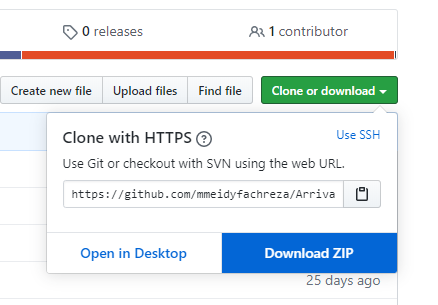

## Cara menggunakan

1. silahkan download project ini terlebih dahulu seperti gambar dibawah dengan mengklik "download zip"

2. lalu ekstrak project ke folder sesuai keinginan

3. akses folder project tadi menggunakan command prompt atau cmd
contoh:

4. setelah itu jalankan perintah "composer install"

5. setelah proses berhasil lalu jalankan perintah "php artisans migrate --seed"

6. setekah proses berhasil jalankan website dennga memasukan perintah "php artisan serv"
note:
pastikan xampp dalam kondisi menyala
